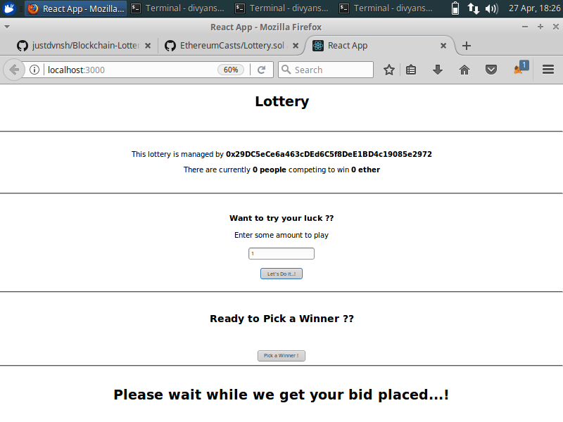
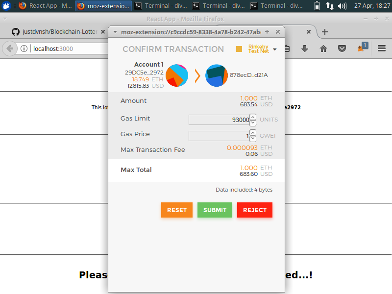
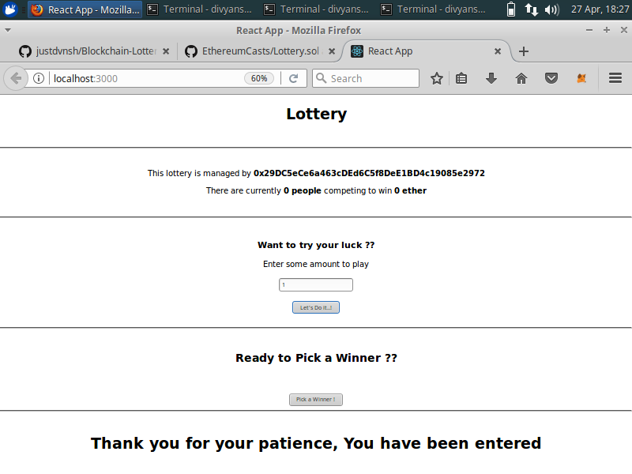
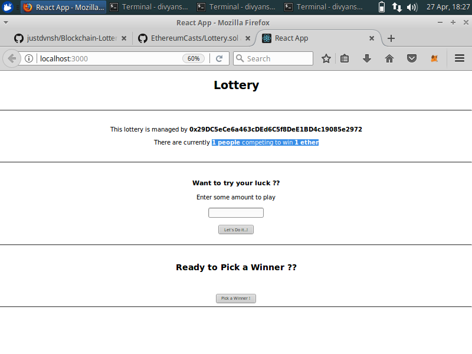
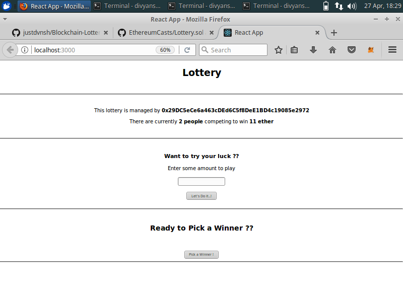
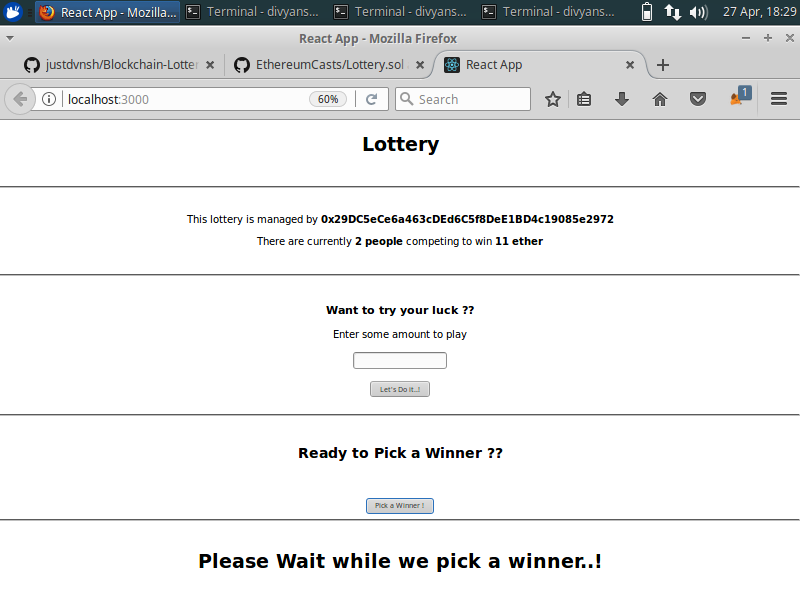
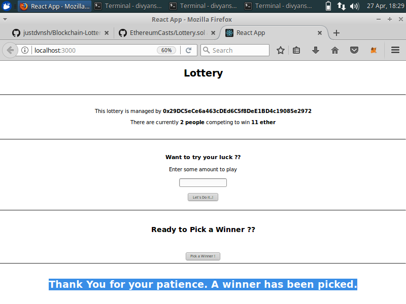

# Blockchain-Lottery-Frontend
This is the front end part of the lottery contract I have made [here](https://github.com/justdvnsh/Blockchain-Lottery).
This front end part is made in react

# Getting Started

- Firstly make sure you have __metamask__ installed.
- clone the repo.
- run npm install
- fire up localhost:3000

# Disclaimer
If you have windows machine make sure you install the windows build tools first.
you can run this command
```javascript
npm i -g --production windows-build-tools
```

# Contributors
Currently I am the only one contributor.

# Liscence
Currently, this project is unliscensed.

# Screenshots









